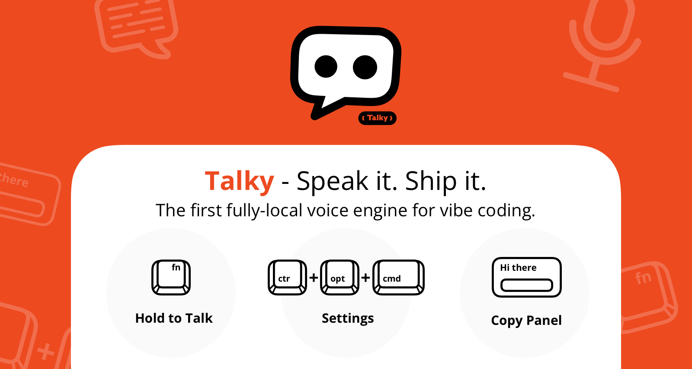

# Talky



Talky is a local-first voice input assistant optimized for macOS (Apple Silicon).  
It captures voice with a hold-to-talk workflow, runs ASR + LLM locally, and outputs polished text into the active app.

**Language:** English | [中文](README.zh.md)

Logo file: [`assets/talky-logo.png`](assets/talky-logo.png)

### 1) Product Highlights and Core Flow

**Highlights**
- Local-first pipeline: ASR + LLM runs on your machine.
- Hold-to-talk interaction: press, speak, release, paste.
- Smart fallback: if no valid focus target, show floating copy panel.
- Daily local archive: `history/YYYY-MM-DD.md`.

**Core operation flow**
1. Hold hotkey to record.
2. Release to transcribe (ASR).
3. Clean text with local LLM.
4. Auto-paste to focused app (or copy panel fallback).

### 2) Pre-Install Checklist

Make sure these are ready before first run:

- `python3 --version` works
- `ollama --version` works
- `ollama list` shows at least one local model
- >= 10 GB free disk space
- Network can reach PyPI + Hugging Face
- (Some machines) `ffmpeg` installed for audio decoding compatibility
- Optional acceleration:
  ```bash
  export HF_TOKEN=your_token_here
  ```

One-command preflight:

```bash
python3 --version && ollama --version && ollama list && \
echo "Disk free:" && df -h .
```

If no model is installed:

```bash
ollama pull <your-model>
```

### 3) Operation Guides (Local and LAN Ollama)

Install prerequisites manually first:
- Python 3
- Ollama: https://ollama.com/download

#### A) Local Ollama (same Mac running Talky)

Step 1 (one-time): system dependencies + environment + Whisper model

```bash
export https_proxy=http://127.0.0.1:7897
export http_proxy=http://127.0.0.1:7897
brew install ffmpeg

cd /path/to/talky
python3 -m venv .venv
source .venv/bin/activate
pip install -r requirements.txt
python3 download_model.py
```

If you use SOCKS proxy and see `socksio` / proxy errors:

```bash
pip install "httpx[socks]"
```

If you use proxy-based model download:

```bash
export HF_ENDPOINT=https://hf-mirror.com
export HF_TOKEN=your_token_here
export all_proxy=socks5://127.0.0.1:7897
python3 download_model.py
```

Step 2 (one-time): first startup

```bash
cd /path/to/talky
chmod +x start_talky.command
./start_talky.command
```

Step 3 (daily): force local mode + auto-restart

```bash
cd /path/to/talky
./start_talky.command --remote "http://127.0.0.1:11434" --model "qwen3.5:9b" --restart
```

Step 4: success signals
- `mode: local`
- `Using Ollama model: ...`
- `ASR elapsed`, `LLM elapsed`, `Final text`

#### B) LAN Ollama (Mac mini model host + MacBook Talky client)

Step 1 (Mac mini): prepare Ollama service and model

```bash
ollama --version
ollama ls
pkill ollama
OLLAMA_HOST=0.0.0.0:11434 ollama serve
```

Open another terminal on Mac mini to verify listener:

```bash
lsof -nP -iTCP:11434 -sTCP:LISTEN
```

Expected: `*:11434` or `0.0.0.0:11434`

Step 2 (Mac mini): get LAN IP

```bash
ipconfig getifaddr en1
```

Step 3 (MacBook): verify connectivity and remote API

```bash
nc -vz <LAN_IP> 11434
curl http://<LAN_IP>:11434/api/tags
```

Step 4 (MacBook): one-line switch to LAN mode + auto-restart

```bash
cd /path/to/talky
./start_talky.command --remote "http://<LAN_IP>:11434" --model "qwen3.5:4b" --restart
```

Step 5: success signals
- `mode: remote`
- `Using Ollama model: qwen3.5:4b`
- `ASR elapsed`, `LLM elapsed`, `Final text`

Optional launcher app:
- Use `talky_launcher.applescript` in this repo as a template.
- Replace `set scriptPath to "/path/to/start_talky.command"` with your local path.
- Export it as an app in Script Editor, then pin to Dock if needed.

Then grant macOS permissions:
- `System Settings -> Privacy & Security -> Microphone`
- `System Settings -> Privacy & Security -> Accessibility`

After startup:
1. Hold hotkey to speak.
2. Release to process.
3. Confirm text is pasted.

Notes:
- No need to run `chmod +x` again.
- Startup checks remote git updates and fast-forwards when available.
- `start_talky.command` unsets proxy variables before app launch to keep local Ollama access stable.
- If your network requires proxy for model download, run `download_model.py` manually (Local Step 1) before daily start.
- In LAN mode, Talky skips local `ollama serve` startup and uses the configured remote host directly.
- First run helper: if no host is configured and local Ollama is unavailable/no model, startup asks you to choose local vs remote host before model check.

#### Quick troubleshooting

If Whisper model is broken/incomplete:

```bash
rm -rf local_whisper_model
source .venv/bin/activate
python download_model.py
./start_talky.command
```

If Ollama warm-up returns `502`:

```bash
pkill ollama
ollama serve
```

### 4) Vision

Talky aims to make voice input truly usable for daily coding and writing:
- private (local compute, no cloud upload)
- clean (remove filler and polish wording)
- practical (works across apps with minimal friction)

It is a focused, local assistant that helps you move from thought to text faster.
