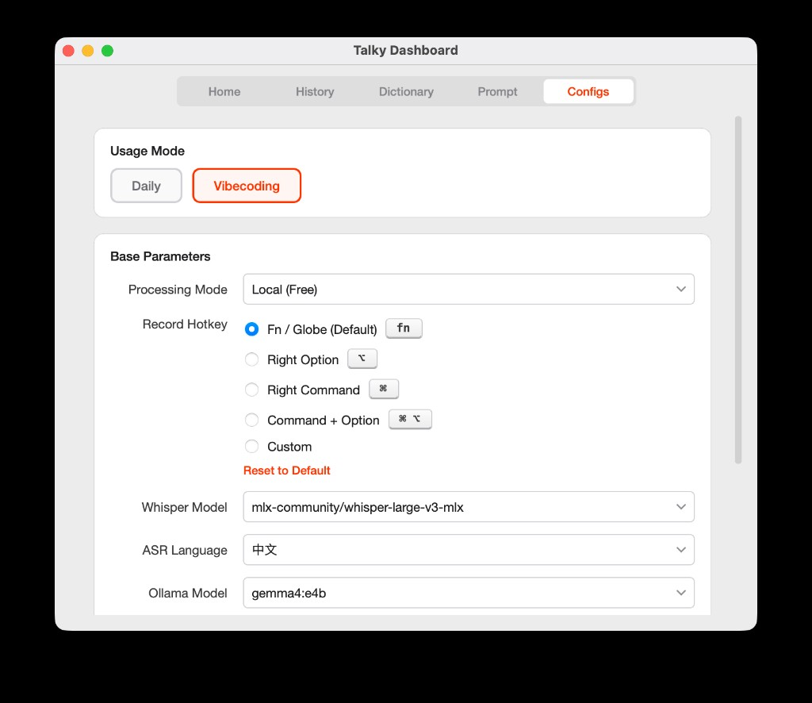

# Talky

**说到，做到。** 首款全本地运行的 Vibe Coding 语音引擎。  
本地 Whisper + LLM — 按住说话，松开即粘贴。零云端，零妥协。

**语言 / Language:** [English](README.md) | 中文

## 下载

**[下载 Talky DMG（最新版本）](https://github.com/shintemy/talky/releases/latest)**

> macOS Apple Silicon · 未签名 / 未公证 — 安装步骤见下方。

## 使用方式

1. **按住** Fn 键开始录音
2. **说话** — 自然表达即可
3. **松开** — Talky 自动转写语音（Whisper）并用本地大模型（Ollama）精炼文本
4. **文本自动粘贴** 到当前应用的输入框

如果没有聚焦的输入框，会弹出悬浮复制面板，手动粘贴即可。

## 安装

1. 从 [Releases](https://github.com/shintemy/talky/releases/latest) 下载 `.dmg` 文件
2. 打开 DMG，将 **Talky** 拖入 **Applications**
3. 首次启动：macOS 会阻止运行 — 前往 **系统设置 → 隐私与安全性**，点击 **仍要打开**
4. 授予 **麦克风** 和 **辅助功能** 权限
5. 设置向导会引导你安装 [Ollama](https://ollama.com/download)、AI 模型和语音模型

## 功能

### Vibe Coding 模式

在 Dashboard → Configs 中切换至 **Vibecoding**，即可将任意语言的口述转为简洁英文 prompt——直接粘贴到 Cursor、Claude 等 AI 编程工具。

- **100% 本地** — ASR + LLM 在本机运行，不上传任何数据
- **按住说话** — 简单直觉的按住交互，无需唤醒词
- **智能粘贴** — 自动粘贴到当前输入框；无焦点时弹出复制面板
- **自定义 Prompt** — 编辑 LLM 系统提示词，匹配你的写作风格
- **词典** — 添加专有名词、术语，提升识别准确率
- **多模式** — 本地 / 远程 Ollama / 云端服务器
- **每日归档** — 所有转写记录自动本地保存

## 系统要求

- macOS（Apple Silicon: M1 / M2 / M3 / M4）
- 已安装 [Ollama](https://ollama.com/download)
- 磁盘剩余空间 ≥ 10 GB（AI 模型 + 语音模型）

## 常见问题

**打不开应用？**  
系统设置 → 隐私与安全性 → 向下滚动 → 点击"仍要打开"。

**没有文字输出？**  
确认 Ollama 正在运行（终端执行 `ollama serve`）。

**Whisper 模型出错？**  
删除 `~/.cache/huggingface/hub/` 后重新通过应用下载。

## 许可

私有项目，保留所有权利。
